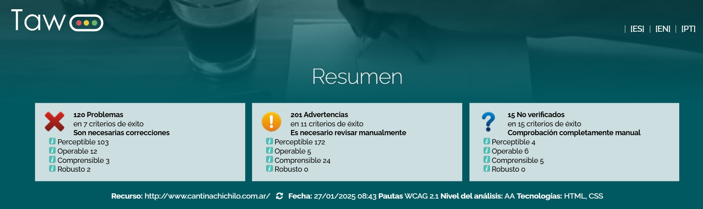
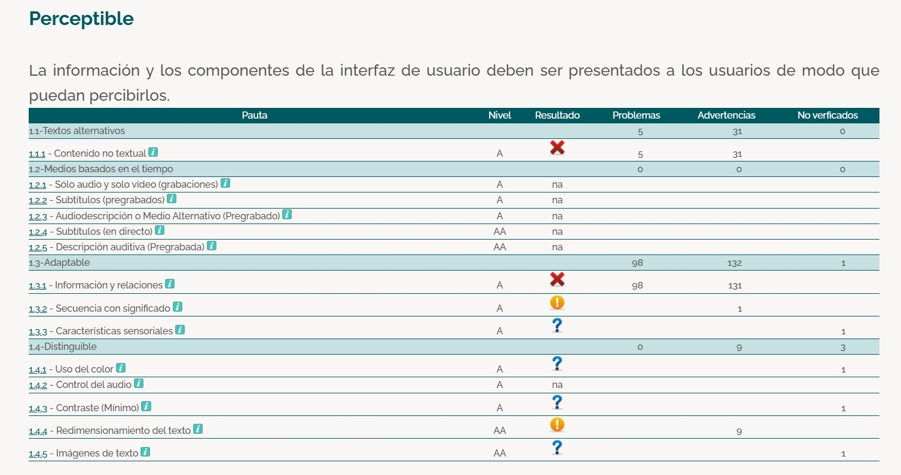
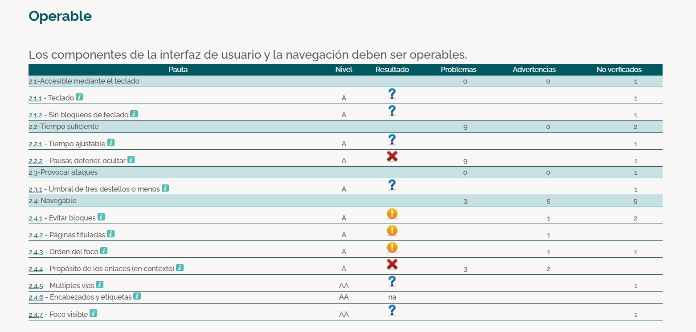
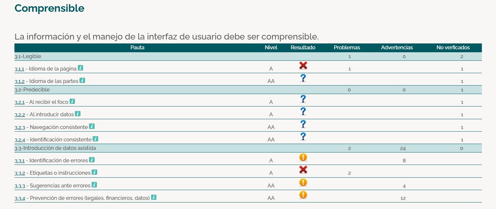
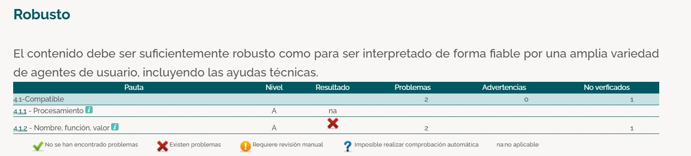
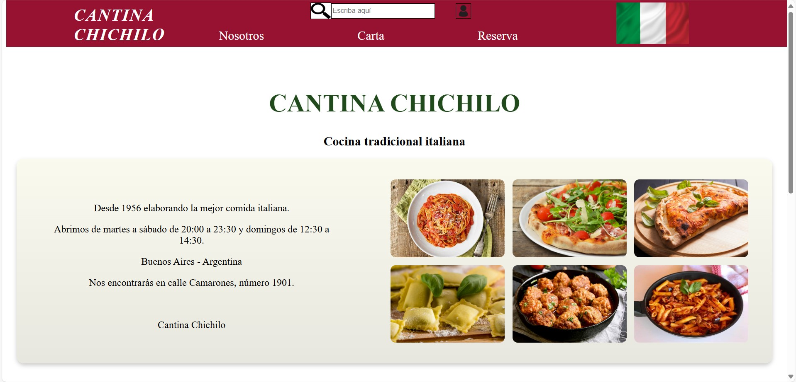
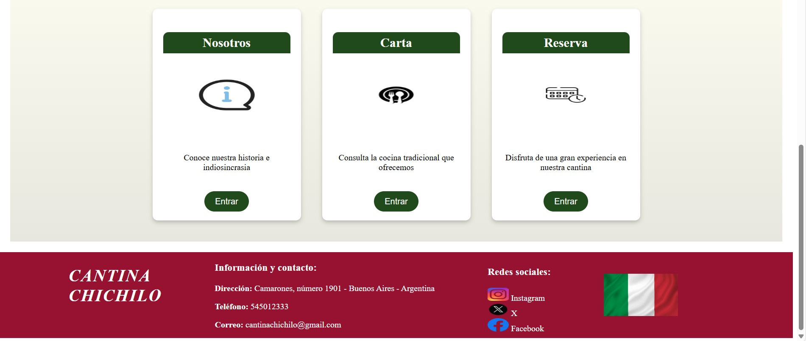

# PROYECTO 5 - MEJORA DE LA ACCESIBILIDAD WEB

---

## Fase 1 - Reconocimiento de la necesidad de accesibilidad web

#### 1. Investigación sobre accesibilidad web

__- ¿Por qué es importante diseñar webs accesibles?:__ porque ofrece beneficios prácticos y legales a las empresas y, sobre todo, ofrece beneficios en la navegación a todo tipo de personas.

__-¿Qué beneficios aporta a los usuarios y a los dessarrolladores?:__  
- Inclusión y acceso equitativo: fomentar un sentido de pertenencia en el mundo digital a las personas con discapacidad.
- Obligaciones legales y éticas: la falta de cumplimiento puede acarrear sanciones. 
- Expansión del alcance de la audiencia, eliminando obstáculos.
- Facilita el acceso universal.
- Optimización de los motores de búsqueda (SEO): Elementos como una navegación clara, encabezados descriptivos y contenido bien estructurado benefician a todos los usuarios, contribuyendo a tiempos de permanencia más largos en el sitio.

__Relación con normativas vigentes:__ Las WCAG 2.1 establecen criterios para que los sitios web sean perceptibles, operables, comprensibles y robustos, categorizándolos en niveles de conformidad A, AA y AAA. En España, el Real Decreto 1112/2018 transpone la Directiva Europea 2016/2102, obligando a organismos públicos y otros actores a cumplir con los estándares de accesibilidad para garantizar la igualdad de acceso.

#### 2. Reflexionar sobre cómo la accesibilidad mejora la experiencia del usuario (UX) y contribuye a la inclusión digital.
Además de las obligaciones legales y éticas implementadas en la actualidad, convertir las páginas webs en accesibles a todos los públicos suponen una inversión en calidad, inclusión y sostenibilidad digital. Además, que el compromiso con las personas es fundamental en cualquier aspecto de la vida, y en el desarrollo web no iba a ser menos. 

---

## Fase 2 - Análisis inicial de accesibilidad en documentos web
#### Página web escogida para el análisis: 
http://www.cantinachichilo.com.ar/.

#### Herramienta seleccionada para el análisis:
TAW.

#### Pruebas:
__1- Resultado generales:__

__2- Perceptibilidad:__

__3- Operabilidad:__

__4- Comprensibilidad:__

__5- Robustez:__

#### Problemas encontrados:
Ya que el sitio web tiene una infinidad de problemas, voy a comentar los más importantes:

__- Perceptibilidad:__ 
No hay nada que facilite la navegación accesible.

No se encuentran elementos de contenido no textual, como CAPTCHAS o elementos sensoriales.
No hay elementos multimedia, como por ejemplo videos, por tanto no se encuentra subtítulos o elementos derivados, para facilitar la navegación.

La presentación de elementos no está bien estructurada.

También falla el contraste entre los textos de gran tamaño y los de pequeño.

__- Operabilidad:__
La navegación entre periféricos distintos al ratón, es inexistente.

Problemas de navegabilidad que presenta: la web no tiene un título claro ni posee elementos para evitar bloques.

---

## Fase 3 - Análisis de principios, pautas y niveles de conformidad

#### 1. Estudiar los principios funamentales:
__Perceptibilidad:__ estudia si los usuarios perciben correctamente la información y los componentes de la interfaz.
__Operabilidad:__ determina si los componentes de la interfaz y la navegación son funcionales para los usuarios.
__Comprensibilidad:__ tal y como el nombre indica, analiza si los componentes son de fácil comprensión para los usuarios.
__Robustez:__ indica si el contenido puede ser interpretado de manera fiable por una variedad de agentes de usuario, incluidas tecnologías de asistencia.

#### 2. Pautas asociadas a cada principio:
__Perceptibilidad:__ 
- Texto alternativo: proporcionar alternativas textuales para el contenido no textual. 
- Adaptabilidad.
- Distinguibilidad.
__Operabilidad:__ 
- Acceso por teclado.
- Suficiente tiempo: para que los usuarios puedan leer y usar el contenido.
- Evitar convulsiones.
- Navegación.
__Comprensibilidad:__ 
- Legibilidad.
- Interfaces predecibles.
- Asistencia en la entrada: ayuda a evitar y corregir errores.
__Robustez:__ 
- Compatibilidad.
- Claridad: a la hora de proporcionar nombres, fuciones y valores a los elementos interactivos.

#### 3. Determinar el nivel de conformidad objetivo (nivel AA) y analizar sus requisitos:
Existen 3 niveles de conformidad: A, AA y AAA.

__Nivel AA:__ es el nivel que indica que el contenido proporciona mejoras adicionales a la accesibilidad, más allá del nivel A, que es el básico. Es el nivel recomendado para cumplir con las normativas.
Para cumplir con el nivel, es necesario:
- Garantizar un contraste mínimo de texto de 4.5:1, que es el que indica que un texto es distinguible para la mayoría de las personas.
- Proveer mecanismos para evitar contenido repetitivo.
- Asegurar que las páginas web sean completamente funcionales a través de un teclado.

#### 4. Ejemplos prácticos:
__Perceptibilidad:__ utilizar descripciones de texto alternativo para las imágenes (alt). 
__Operabilidad:__ asegurarse de que los botones y enlaces puedan activarse con teclas de tabulación y con la tecla Enter.
__Comprensibilidad:__ a la hora de completar un usuario, introducir mensajes de corrección. Por ejemplo, "Por favor, introduzca una contraseña con más de 6 caracteres".
__Robustez:__ utilizar etiquetas para botones interactivos, como puede ser aria-label="Enviar formulario".

---

## Fase 5 - Implementación para alcanzar el nivel deseado

Para el desarrollo de esta fase:
- En primer lugar, las pruebas que muestran cómo estaba la web antes, están ubicadas en la Fase 2 de este proyecto.
- En lugar de aplicar mejoras a la página, voy a construir el index desde el principio, es decir, voy a ofrecer una versión nueva, ya que mejorar tantísimos elementos que tiene el interminable index de la web seleccionada, sería una tarea demasiado extensa.

Página HOME nueva para la cantina:

