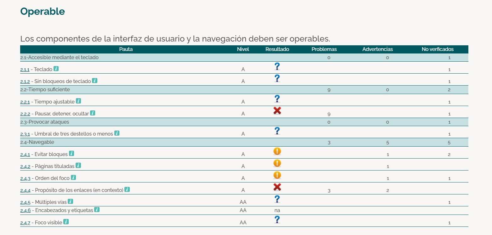
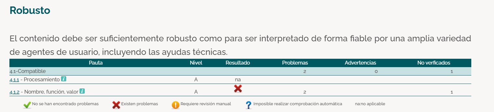
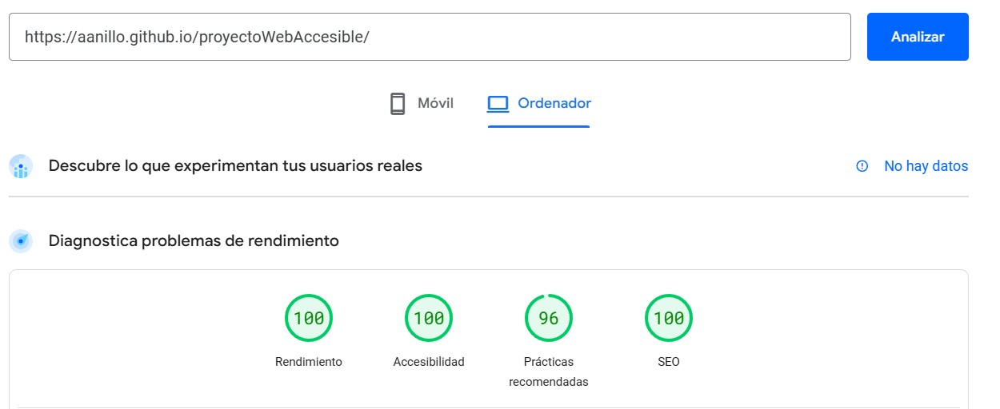

# PROYECTO 5 - MEJORA DE LA ACCESIBILIDAD WEB

## Alfonso Jesús Anillo Romero  

## Diseño de interfaces web  

## 2º DAW  

---
     
## ÍNDICE

- [Fase 1 - Reconocimiento de la necesidad de accesibilidad web](#fase-1---reconocimiento-de-la-necesidad-de-accesibilidad-web)
    - [1.1 - Investigación sobre accesibilidad web](#1-investigación-sobre-accesibilidad-web)
    - [1.2 - Reflexión sobre la accesibilidad y la experiencia del usuario](#2-reflexión-sobre-la-accesibilidad-y-la-experiencia-del-usuario-ux)
- [Fase 2 - Análisis inicial de accesibilidad en documentos web](#fase-2---análisis-inicial-de-accesibilidad-en-documentos-web)
    - [2.1 - Página web analizada](#1-página-web-analizada)
    - [2.2 - Herramienta utilizada](#2-herramienta-utilizada)
    - [2.3 - Pruebas y resultados](#3-pruebas-y-resultados)
    - [2.4 - Problemas detectados](#4-problemas-detectados)
- [Fase 3 - Análisis de principios, pautas y niveles de conformidad](#fase-3---análisis-de-principios-pautas-y-niveles-de-conformidad)
    - [3.1 - Principios fundamentales](#1-principios-fundamentales)
    - [3.2 - Pautas asociadas](#2-pautas-asociadas)
    - [3.3 - Nivel de conformidad objetivo](#3-nivel-de-conformidad-objetivo)
    - [3.4 - Requisitos de nivel AA](#4-requisitos-del-nivel-aa)
    - [3.5 - Ejemplos prácticos](#5-ejemplos-prácticos)
- [Fase 4 - Análisis y priorización de errores según puntos de verificación](#fase-4---análisis-y-priorización-de-errores-según-puntos-de-verificación)
- [Fase 5 - Implementación de mejoras](#fase-5---implementación-de-mejoras)
    - [5.1 - Nueva página HOME](#1---nueva-página-home)
    - [5.2 - Mejoras implementadas](#2---mejoras-implementadas)
- [Fase 6 - Verificación mediante tests externos](#fase-6---verificación-mediante-tests-externos)
    - [6.1 - Prueba en TAW](#1---prueba-en-taw)
    - [6.2 - Prueba en Sortsite](#2---prueba-en-sortsite)
    - [6.3 - Pruebas manuales](#3---pruebas-manuales)
- [Fase 7 - Verifiación multiplataforma](#fase-7---verificación-multiplataforma)
    - [7.1 - Pruebas en navegadores](#1---pruebas-en-navegadores)
    - [7.2 - Verificación en dispositivos móviles](#2---verificación-en-dispositivos-móviles)
- [Fase 8 - Análisis y estrategias para mejorar la visibilidad en buscadores](#fase-8---análisis-y-estrategias-para-mejorar-la-visibilidad-en-buscadores)
    - [8.1 - SEO On-Page](#1---seo-on-page)
    - [8.2 - SEO técnico](#2---seo-técnico)
    - [8.1 - Evaluación del SEO](#3---evaluación-del-seo)
---  

## Fase 1 - Reconocimiento de la necesidad de accesibilidad web  

### 1. Investigación sobre accesibilidad web  

**¿Qué es la accesibilidad web?**
  
La accesibilidad web se refiere a la práctica de diseñar sitios web y aplicaciones de manera que sean utilizables para todas las personas, incluidas aquellas con discapacidades. El objetivo es garantizar que todos los usuarios puedan percibir, entender, navegar e interactuar con la web de manera eficaz.
\
**¿Por qué es importante diseñar webs accesibles?**  

Porque ofrece beneficios prácticos y legales a las empresas y, sobre todo, mejora la navegación para todo tipo de personas.
\
**¿Qué beneficios aporta a los usuarios y a los desarrolladores**
  
- **Inclusión y acceso equitativo**: fomenta un sentido de pertenencia en el mundo digital para personas con discapacidad.
- **Obligaciones legales y éticas**: la falta de cumplimiento puede acarrear sanciones.
- **Expansión del alcance de la audiencia**, eliminando obstáculos.
- **Facilita el acceso universal**.
- **Optimización SEO**: elementos como navegación clara, encabezados descriptivos y contenido bien estructurado benefician la experiencia del usuario y mejoran el posicionamiento.
  
\
**Relación con normativas vigentes**  

Las **WCAG 2.1** establecen criterios para que los sitios web sean perceptibles, operables, comprensibles y robustos, categorizándolos en niveles de conformidad A, AA y AAA.  

En España, el **Real Decreto 1112/2018** transpone la **Directiva Europea 2016/2102**, obligando a organismos públicos y otros actores a cumplir con los estándares de accesibilidad.
  

### 2. Reflexión sobre la accesibilidad y la experiencia del usuario (UX)

Convertir las páginas webs en accesibles supone una inversión en **calidad, inclusión y sostenibilidad digital**. El compromiso con las personas es fundamental en cualquier ámbito, y el desarrollo web no es una excepción.

Más aún, teniendo en cuenta que internet es prácticamente un bien esencial actualmente. Son muchas las gestiones a las que la ciudadanía se ve obligada a realizar a través de las páginas webs o aplicaciones móviles, por lo cual la navegación debe estar al alcance de todo el mundo.

---

## Fase 2 - Análisis inicial de accesibilidad en documentos web

### 1. Página web analizada
[Cantina Chichilo](http://www.cantinachichilo.com.ar/)

### 2. Herramienta utilizada
**TAW**

### 3. Pruebas y resultados

1. **Resultados generales:**  

   

\
2. **Perceptibilidad:**  

   

\
3. **Operabilidad:**  
   

\
4. **Comprensibilidad:**  
   

\
5. **Robustez:**  
   

### 4. Problemas detectados

El informe de TAW ha reportado un total de 120 problemas, de los cuales voy a comentar los más importantes.

#### **Contenido no textual**
- Controles de formulario sin etiquetar.
- Imágenes sin atributo **alt**.
- Enlaces consecutivos de texto e imagen al mismo recurso.
Algunas imágenes podrían requerir una descripción más detallada para ser comprendidas correctamente.

#### **Información y relaciones**
- Falta del elemento **h1**.
- Uso de tablas en la navegación.
- Etiquetas mal utilizadas.
- Se han detectado enlaces con imágenes y texto que apuntan al mismo destino sin estar agrupados.

#### **Uso del color**
- Información transmitida solo con color.
- Bajo contraste entre texto y fondo.
- Uso de fuentes con tamaño absoluto en lugar de relativo.

---

## Fase 3 - Análisis de principios, pautas y niveles de conformidad

### 1. Principios fundamentales
##### Requisitos:
**Perceptibilidad:** asegurarse de que la información y los componentes de la interfaz de usuario sean perceptibles para todos los usuarios.

**Operabilidad:** garantizar que la interfaz sea operable para todos los usuarios.

**Comprensibilidad:** hacer que el contenido y la operación de la interfaz sean comprensibles para todos los usurios.

**Robustez:** garantizar que el contenido sea compatible con diferentes tecnologías de asistencia.

### 2. Pautas asociadas

- **Perceptibilidad**: Texto alternativo, adaptabilidad, distinguibilidad.

- **Operabilidad**: Acceso por teclado, tiempo suficiente, evitar convulsiones, navegación.

- **Comprensibilidad**: Legibilidad, interfaces predecibles, asistencia en la entrada.

- **Robustez**: Compatibilidad, claridad.

### 3. Nivel de conformidad objetivo
El nivel **AA** es el recomendado para cumplir normativas. 

### 4. Requisitos del nivel AA:
**Contraste de colores:** el contraste entre el texto y el fondo debe ser de al menos 4.5:1 para el texto normal y 3:1 para el texto grande.

**Ajuste de texto:** los usuarios deben poder ajustar el tamaño del texto hasta un 200% sin perder contenido o funcionalidad.

**Navegación accesible:** deben proporcionarse múltiples maneras de encontrar páginas en un sitio web.

**Elementos de una interfaz accesibles:** las etiquetas y las instrucciones deben ser claras y estar disponibles para los componentes de la interfaz de usuario.

**Compatibilidad con teclado:** todo el contenido debe ser navegable y accesible mediante un teclado.

**Error y sugerencia de corrección:** deben proporcionarse sugerencias de corrección cuando el usuario comete un error de entrada.

**Autenticación más accesible:** proporcionar más de un método de autenticación o acceso, y asegurarse de que los métodos de autenticación sean accesibles.

### 5. Ejemplos prácticos
- **Perceptibilidad**: Descripciones en **alt**.
- **Operabilidad**: Botones navegables con **tab** y **Enter**.
- **Comprensibilidad**: Mensajes de corrección en formularios.
- **Robustez**: Uso de etiquetas **aria-label**.

---

## Fase 4 - Análisis y priorización de errores según puntos de verificación

Para resolver los errores críticos, vistos en las fases anteriores, realizaré:

- Añadiré "alt" para describir las imágenes
- Estableceré una estructura semántica correcta, con las etiquetas "h" colocadas en el orden correcto
- Proporcionaré un contraste más adecuado entre los colores base y de fondo
- Añadiré efectos de hover a los enlaces, para facilitar la localización
- Buscaré centrar el impacto visual en los elementos más importantes
- Introduciré una barra de búsqueda
- Aplicaré etiquetado "aria-label" para elementos que no muestran texto
- Estableceré el mismo tamaño a todas las imágenes

---

## Fase 5 - Implementación de mejoras

Dado que la web original tiene demasiados problemas, se ha decidido reconstruir el **index** desde cero.

### 1 - Nueva página HOME
Parte 1: 
\
 
Parte 2:
\

Parte 3:
\

### 2 - Mejoras implementadas
- Contraste de colores mejorado, estableciendo colores más oscuros en los botones, en header y en footer, donde la tipografía es de color blanco. En el resto del documento, el color de los textos es negro y el fondo, blanco.
- Mejor visibilidad del texto y mejor ubicación visual de los elementos.
- Estructura semántica con **header, main, section, article, footer**, además de una ordenación adecuada de las etiquetas **h1, h2, h3**.
- Sombras en fondos y organización optimizada.
- Navegación accesible con teclado.
- Efectos visuales en enlaces, tanto cuando el ratón se sitúe sobre el enlace, como cuando se navega por teclado.
- Imágenes con textos descriptivos ("alt").
- Etiquetas "aria-label" y derivadas para mejorar las descripciones y que sean más reconocibles y más descriptivas, sobre todo a la hora de utilizar los lectores de textos.
- Barra de búsqueda con su etiqueta **label** de acompañamiento.
- Dotar a las imágenes del mismo tamaño y de una estructura clara.

---

## Fase 6 - Verificación mediante tests externos

### 1 - Prueba en TAW

Resultados de accesibilidad **nivel AA** sin errores:

Detalles:

  
  

### 2 - Prueba en Sortsite

Confirmación de accesibilidad **nivel AA**:

### 3 - Pruebas manuales

**Verificación mediante teclado:**

Muestro un primer ejemplo referente a la navegación mediante teclado, en concreto cuando se sitúa en el enlace **Nosotros**.
\

Otro ejemplo, es cuando la tabulación llega hasta el botón de **Ver menú**.
\

---

## Fase 7 - Verificación multiplataforma

### 1 - Pruebas en navegadores

- **Microsoft Bing**:  
\
  

- **Google Chrome**:  
\
  

- **Firefox**:  
\
  

### 2 - Verificación en dispositivos móviles

Pruebas realizadas para garantizar adaptabilidad y accesibilidad en diferentes dispositivos.

- **Móvil**:
\
    

---

## Fase 8 - Análisis y estrategias para mejorar la visibilidad en buscadores

### 1 - SEO On-page:
- El empleo de etiquetas semánticas, lo apliqué previamente en fases anteriores.

- El título descriptivo también estaba ya incuido.

- Sobre la configuración de las descriciones "meta", procedo a añadir "meta description", indicando un breve resumen de la página.

- También añado la etiqueta "meta keywords" con las palabras claves de la web.
\
    

### 2 - SEO técnico:
Para este punto, desarrollo un **sitemap** dinámico utilizando Express, que incluya las rutas principales de la aplicación.
Para ello, el lugar donde se realiza es en [Sitemaps](http://www.xml-sitemaps.com).

Sitemaps:
\
    

XML proporcionado por Sitemaps:
\
    

### 3 - Evaluación del SEO:

Antes de introducir las mejoras, los resultados fueron éstos:
    

**PageSpeedInsights** proporcionó las siguientes recomendaciones:
    

Luego de introducir la metadescription y cambiar los enlaces:
    

Consigo la puntuación de **100** tanto en **accesibilidad**, como en **SEO**.
Para alcanzar el 100 en SEO, añadí las etiquetas meta que he mostrado en el primer apartado sobre SEO y he añadido href="#" en los enlaces del nav.

