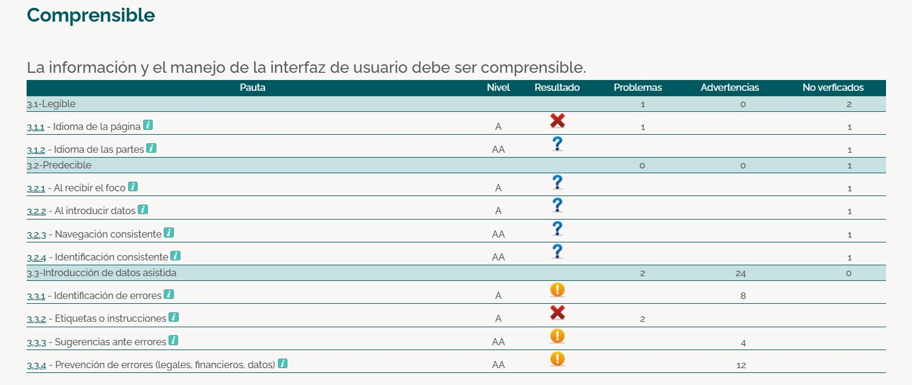
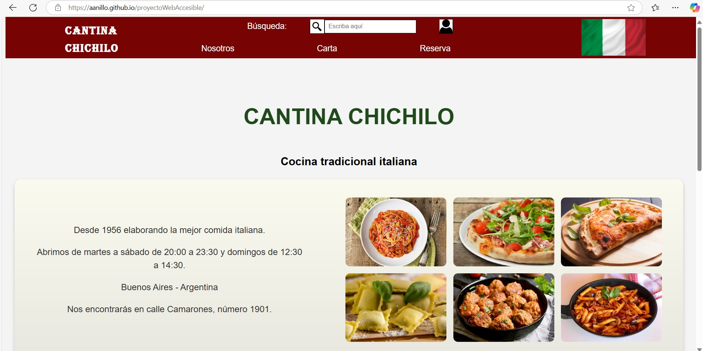
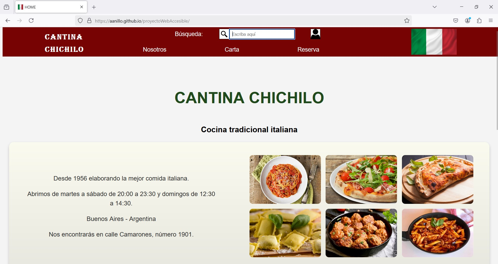

# PROYECTO 5 - MEJORA DE LA ACCESIBILIDAD WEB

---

## Fase 1 - Reconocimiento de la necesidad de accesibilidad web

### 1. Investigación sobre accesibilidad web

**¿Por qué es importante diseñar webs accesibles?**  
Porque ofrece beneficios prácticos y legales a las empresas y, sobre todo, mejora la navegación para todo tipo de personas.

**¿Qué beneficios aporta a los usuarios y a los desarrolladores?**  
- **Inclusión y acceso equitativo**: fomenta un sentido de pertenencia en el mundo digital para personas con discapacidad.
- **Obligaciones legales y éticas**: la falta de cumplimiento puede acarrear sanciones.
- **Expansión del alcance de la audiencia**, eliminando obstáculos.
- **Facilita el acceso universal**.
- **Optimización SEO**: elementos como navegación clara, encabezados descriptivos y contenido bien estructurado benefician la experiencia del usuario y mejoran el posicionamiento.

**Relación con normativas vigentes**  
Las **WCAG 2.1** establecen criterios para que los sitios web sean perceptibles, operables, comprensibles y robustos, categorizándolos en niveles de conformidad A, AA y AAA.  
En España, el **Real Decreto 1112/2018** transpone la **Directiva Europea 2016/2102**, obligando a organismos públicos y otros actores a cumplir con los estándares de accesibilidad.

### 2. Reflexión sobre la accesibilidad y la experiencia del usuario (UX)
Convertir las páginas webs en accesibles supone una inversión en **calidad, inclusión y sostenibilidad digital**. El compromiso con las personas es fundamental en cualquier ámbito, y el desarrollo web no es una excepción.

---

## Fase 2 - Análisis inicial de accesibilidad en documentos web

### Página web analizada
[Cantina Chichilo](http://www.cantinachichilo.com.ar/)

### Herramienta utilizada
**TAW**

### Pruebas y resultados

1. **Resultados generales:**  
   

2. **Perceptibilidad:**  
   

3. **Operabilidad:**  
   

4. **Comprensibilidad:**  
   

5. **Robustez:**  
   

### Problemas detectados

#### **Contenido no textual**
- Controles de formulario sin etiquetar.
- Imágenes sin atributo **alt**.
- Enlaces consecutivos de texto e imagen al mismo recurso.
Algunas imágenes podrían requerir una descripción más detallada para ser comprendidas correctamente.

#### **Información y relaciones**
- Falta del elemento **h1**.
- Uso de tablas en la navegación.
- Etiquetas mal utilizadas.
- Se han detectado enlaces con imágenes y texto que apuntan al mismo destino sin estar agrupados.

#### **Uso del color**
- Información transmitida solo con color.
- Bajo contraste entre texto y fondo.
- Uso de fuentes con tamaño absoluto en lugar de relativo.

---

## Fase 3 - Análisis de principios, pautas y niveles de conformidad

### 1. Principios fundamentales
##### Requisitos:
**Perceptibilidad:** asegurarse de que la información y los componentes de la interfaz de usuario sean perceptibles para todos los usuarios.
**Operabilidad:** garantizar que la interfaz sea operable para todos los usuarios.
**Comprensibilidad:** hacer que el contenido y la operación de la interfaz sean comprensibles para todos los uaurios.
**Robustez:** garantizar que el contenido sea compatible con diferentes tecnologías de asistencia.

### 2. Pautas asociadas
- **Perceptibilidad**: Texto alternativo, adaptabilidad, distinguibilidad.
- **Operabilidad**: Acceso por teclado, tiempo suficiente, evitar convulsiones, navegación.
- **Comprensibilidad**: Legibilidad, interfaces predecibles, asistencia en la entrada.
- **Robustez**: Compatibilidad, claridad.

### 3. Nivel de conformidad objetivo
El nivel **AA** es el recomendado para cumplir normativas. 

### 4. Requisitos del nivel AA:
**Contraste de colores:** el contraste entre el texto y el fondo debe ser de al menos 4.5:1 para el texto normal y 3:1 para el texto grande.
**Ajuste de texto:** los usuarios deben poder ajustar el tamaño del texto hasta un 200% sin perder contenido o funcionalidad.
**Navegación accesible:** deben proporcionarse múltiples maneras de encontrar páginas en un sitio web.
**Elementos de una interfaz accesibles:** las etiquetas y las instrucciones deben ser claras y estar disponibles para los componentes de la interfaz de usuario.
**Compatibilidad con teclado:** todo el contenido debe ser navegable y accesible mediante un teclado.
**Error y sugerencia de corrección:** deben proporcionarse sugerencias de corrección cuando el usuario comete un error de entrada.
**Autenticación más accesible:** proporcionar más de un método de autenticación o acceso, y asegurarse de que los métodos de autenticación sean accesibles.

### 5. Ejemplos prácticos
- **Perceptibilidad**: Descripciones en **alt**.
- **Operabilidad**: Botones navegables con **tab** y **Enter**.
- **Comprensibilidad**: Mensajes de corrección en formularios.
- **Robustez**: Uso de etiquetas **aria-label**.

---

## Fase 5 - Implementación de mejoras

Dado que la web original tiene demasiados problemas, se ha decidido reconstruir el **index** desde cero.

### Nueva página HOME
  

### Mejoras implementadas
- Contraste de colores mejorado.
- Mejor visibilidad del texto.
- Estructura semántica con **header, main, section, article, footer**, además de una ordenación adecuada de las etiquetas **h1, h2, h3**.
- Sombras en fondos y organización optimizada.
- Navegación accesible con teclado.
- Efectos visuales en enlaces.
- Imágenes con textos descriptivos (**alt**).
- **Accesibilidad añadida**.

---

## Fase 6 - Verificación mediante tests externos

### Prueba en TAW

Resultados de accesibilidad **nivel AA** sin errores:

Detalles:

  
  

### Prueba en Sortsite

Confirmación de accesibilidad **nivel AA**:

---

## Fase 7 - Verificación multiplataforma

### Pruebas en navegadores

- **Microsoft Bing**:  
  

- **Google Chrome**:  
  

- **Firefox**:  
  

### Verificación en dispositivos móviles

Pruebas realizadas para garantizar adaptabilidad y accesibilidad en diferentes dispositivos.

- **Móvil**:
    

---

## Fase 8 - Análisis y estrategias para mejorar la visibilidad en buscadores

### 1. SEO On-page:
- El empleo de etiquetas semánticas, lo apliqué previamente en fases anteriores.
- El título descriptivo también estaba ya incuido.
- Sobre la configuración de las descriciones "meta", procedo a añadir "meta description", indicando un breve resumen de la página.
- También añado la etiqueta "meta keywords" con las palabras claves de la web.

    

### 2. SEO técnico:
Para este punto, desarrollo un **sitemap** dinámico utilizando Express, que incluya las rutas principales de la aplicación.
Para ello, el lugar donde se realiza es en [Sitemaps](http://www.xml-sitemaps.com).

Sitemaps:
    

XML proporcionado por Sitemaps:
    

### 3. SEO Off-page:
